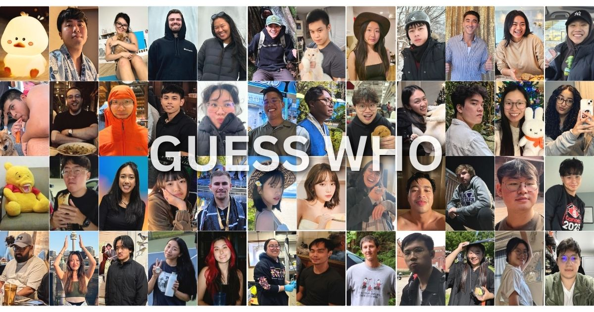

# Guess Who! - Scole Edition


## Overview
Guess Who! - Scole Edition is a web-based interactive guessing game inspired by the classic guess who board game which is usually meant for players to play 1 on 1 against each other. It allows players to eliminate options by clicking on images, randomly select a character for the other player to try to guess, and take notes using an integrated notepad.

## Features
- **Interactive Image Grid**: Tap images to mark them as deselected.
- **Category Selection**: Includes a `Scole Party` category and an `Other` category.
- **Toggle Functionality**: Easily deselect or reselect the `Other` category with a button.
- **Random Character Picker**: Selects a random image from the remaining options.
- **Lock Feature**: Locks the selected character to prevent re-selection.
- **Notepad**: A built-in notepad to jot down clues or notes.
- **Dynamic Image Loading**: Images are fetched dynamically from a GitHub repository.

## Technologies Used
- **HTML, CSS, JavaScript** for the frontend.
- **GitHub API** for retrieving image assets dynamically.
- **Google Fonts** for a custom typography experience.

## How to Play
1. Requires 2 players and 2 devices to play.
2. Open the webpage in your browser. [Play Guess Who!](https://scottctram.github.io/guesswho/scole.html)
3. Use the `Pick Random Image` button to select a character (this is the person that other player is trying to guess, don't show them).
4. Lock the selection if needed.
5. Take turns asking questions (does my character have glasses, if yes, click on all characters that don't have glasses to deselect).
6. Use the notepad to write hints or notes.
7. Reset or reselect characters as required.
8. Refresh the page to start a new game.

## File Structure
```
/guesswho
├── scole.html         # Main HTML file
├── styles.css         # Stylesheet
├── script.js         # Main JavaScript logic
├── images/           # Contains categorized images
│   ├── scoleparty/   # Scole Party images
│   ├── otherparty/   # Other images
```

## Future Enhancements
- Add more categories and customization options.
- Add metadata or about me to each image when locked.
- Improve image quality and cropping.
- Implement multiplayer functionality.
- Improve mobile responsiveness.

## Author
**Scott Tram**

## License
This project is licensed under the [MIT License](LICENSE).
